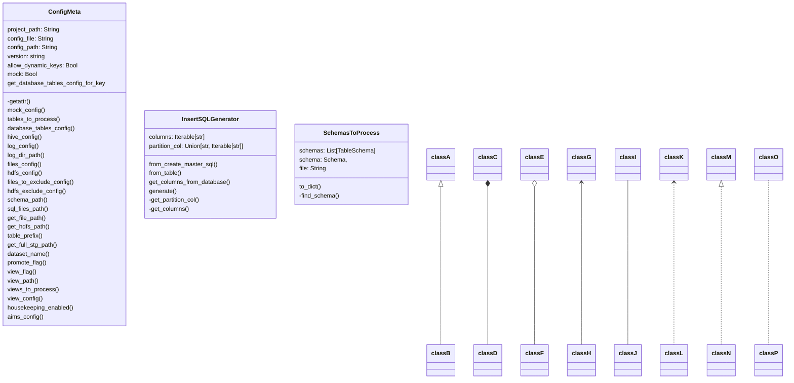

```mermaid
classDiagram
    class ConfigMeta {
        project_path: String
        config_file: String
        config_path: String
        version: string
        allow_dynamic_keys: Bool
        mock: Bool
        -getattr()
        mock_config()
        tables_to_process()
        database_tables_config()
        hive_config()
        log_config()
        log_dir_path()
        files_config()
        hdfs_config()
        files_to_exclude_config()
        hdfs_exclude_config()
        schema_path()
        sql_files_path()
        get_file_path()
        get_hdfs_path()
        get_database_tables_config_for_key
        table_prefix()
        get_full_stg_path()
        dataset_name()
        promote_flag()
        view_flag()
        view_path()
        views_to_process()
        view_config()
        housekeeping_enabled()
        aims_config()


    }

    class InsertSQLGenerator {
        columns: Iterable[str]
        partition_col: Union[str, Iterable[str]]
        from_create_master_sql()
        from_table()
        get_columns_from_database()
        generate()
        -get_partition_col()
        -get_columns()

    }

    class SchemasToProcess {
        schemas: List[TableSchema]
        schema: Schema, 
        file: String
        to_dict()
        -find_schema()
    }

    classA <|-- classB
    classC *-- classD
    classE o-- classF
    classG <-- classH
    classI -- classJ
    classK <.. classL
    classM <|.. classN
    classO .. classP
```

